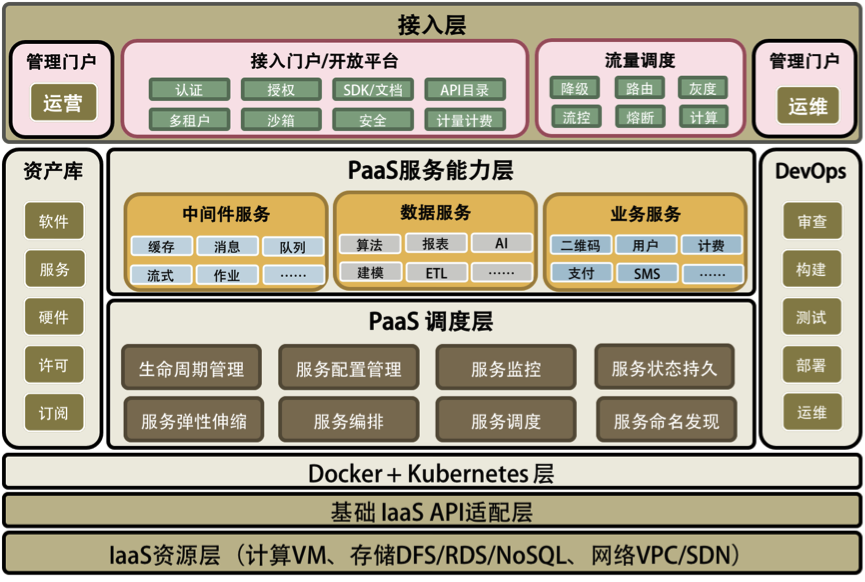

## 什么是PaaS

### PaaS的定义

PaaS（平台即服务） 是一个云计算模型，旨在为客户提供完整的云平台，用于开发、运行和管理应用程序，而无需考虑在本地构建和维护该平台通常会带来的成本、复杂性和不灵活性。

 PaaS 提供商将一切工具都托管在其数据中心上。 通常，客户可以支付固定费用来为指定数量的用户提供指定数量的资源，也可以选择“按使用量付费” 定价 模式以仅为他们使用的资源付费。

### PaaS 的优势

- **缩短上市时间。** 
- **以经济实惠的方式访问更多种类的资源。**  
- **提高试验自由度并降低风险。** 
- **提供简单且经济高效的可扩展性。** 
- **为开发团队提供更高的灵活性 。**
- **降低整体成本。**

### PaaS 的工作原理

通常， PaaS 解决方案 包含三个主要部分：

- 云基础架构，包括虚拟机 (VM)、操作系统软件、存储、网络、防火墙
- 软件，用于构建、部署和管理应用程序
- 图形用户界面 (GUI)，开发团队或 DevOps 团队可以在其中完成整个应用程序生命周期内的所有工作

PaaS 通过 GUI 在线界面提供所有标准开发工具 ，因此开发人员可以从任何地方登录该界面以协作处理项目、测试新应用程序或推出已完成的产品。 应用程序是使用中间件在 PaaS 中设计和开发的。 通过简化的工作流程，多个开发团队和运营团队可以同时处理同一个项目。

### PaaS、IaaS 和 SaaS

基础架构即服务 (IaaS) 和软件即服务 (SaaS) 也是非常常见的云计算服务模型。 

**IaaS** 是对由云提供商托管的“原始” IT 基础架构（物理服务器、 虚拟机、存储、网络、 防火墙）的互联网访问。 

任何 PaaS 产品 都必须包含托管它所需的 IaaS 资源，即使这些资源没有被离散分解或称为 IaaS。

**SaaS** 是通过云使用的应用软件，就好像它安装在您的计算机上一样（在某些情况下，它的*某些部分* 安装在您的计算机上）。 SaaS 使组织可以使用应用程序，而无需设置用于运行该应用程序的基础架构以及维护该应用程序（应用错误修订和更新、解决中断等）。大多数 Web 应用程序 都被视为 SaaS。

每个 SaaS 产品都包含托管它所需的 IaaS 资源，并且至少包含运行它所需的 PaaS 组件。 一些 SaaS 供应商还提供了独立的 PaaS ，它允许第三方定制 SaaS 产品。

### PaaS 用例

- **API 开发和管理**
- **物联网 (IoT)** 
- **敏捷开发和 DevOps**
- **云迁移和云原生开发** 
- **混合云战略：** [混合云](https://www.ibm.com/cn-zh/topics/hybrid-cloud) 集成了 [公共云](https://www.ibm.com/cn-zh/topics/public-cloud) 服务、 [私有云](https://www.ibm.com/cn-zh/topics/private-cloud) 服务和 [本地基础架构](https://www.ibm.com/cn-zh/hybrid-cloud) ，并在这三者之间实现了编排、管理和应用程序可移植性。 这将打造一个统一且灵活的分布式计算环境。

### 专门构建的 PaaS 类型

- **AIPaaS** 
- **iPaaS（集成平台即服务）** 用于集成应用程序的云托管解决方案。 iPaaS 为组织提供了一种标准方法来连接公共云、 私有云 和 本地环境中的数据、流程和服务，而无需购买、安装和管理自己的后端集成硬件、 中间件和软件。
- **cPaaS（通信平台即服务）** 可让开发人员轻松地向应用程序添加语音、视频和消息传递功能，而无需投资专门的通信硬件和软件。 
- **mPaaS（移动平台即服务）** 是一种用于简化面向移动设备的应用程序开发 的 PaaS 。 mPaaS 通常提供低代码方法来访问特定于设备的功能，包括手机的摄像头、麦克风、运动传感器和地理定位（或 GPS）功能。

## 洞悉PaaS平台的本质

### 软件工程的本质。

**1. 提高服务的 SLA。** 所谓服务的 SLA，也就是能提供多少个 9 的系统可用性，而每提高一个 9 的可用性都是对整个系统架构的重新洗礼。提高系统的 SLA 主要表现在两个方面：高可用的系统；自动化的运维。

**2. 能力和资源重用或复用。** 软件模块的重用，软件运行环境和资源的重用。需要有两个重要的能力：一个是“软件抽象的能力”，另一个是“软件标准化的能力”。

**3. 过程的自动化。** **软件工程的第三个本质就是把软件生产和运维的过程自动化起来**。也就是：软件生产流水线，软件运维自动化。为此，我们除了需要 CI/CD 的 DevOps 式的自动化之外，也需要能够对正在运行的生产环境中的软件进行自动化运维。

### PaaS 平台的本质

一个好的 PaaS 平台应该具有分布式、服务化、自动化部署、高可用、敏捷以及分层开放的特征，并可与 IaaS 实现良好的联动。

PaaS 跟传统中间件最大的差别：

**1. 服务化是 PaaS 的本质**。软件模块重用，服务治理，对外提供能力是 PaaS 的本质。

**2. 分布式是 PaaS 的根本特性**。多租户隔离、高可用、服务编排是 PaaS 的基本特性。

**3. 自动化是 PaaS 的灵魂**。自动化部署安装运维，自动化伸缩调度是 PaaS 的关键。

#### PaaS 平台的总体架构

一个完整的 PaaS 平台会包括以下几部分。

1. PaaS 调度层 – 主要是 PaaS 的自动化和分布式对于高可用高性能的管理。

2. PaaS 能力服务层 – 主要是 PaaS 真正提供给用户的服务和能力。

3. PaaS 的流量调度 – 主要是与流量调度相关的东西，包括对高并发的管理。

4. PaaS 的运营管理 – 软件资源库、软件接入、认证和开放平台门户。

5. PaaS 的运维管理 – 主要是 DevOps 相关的东西。